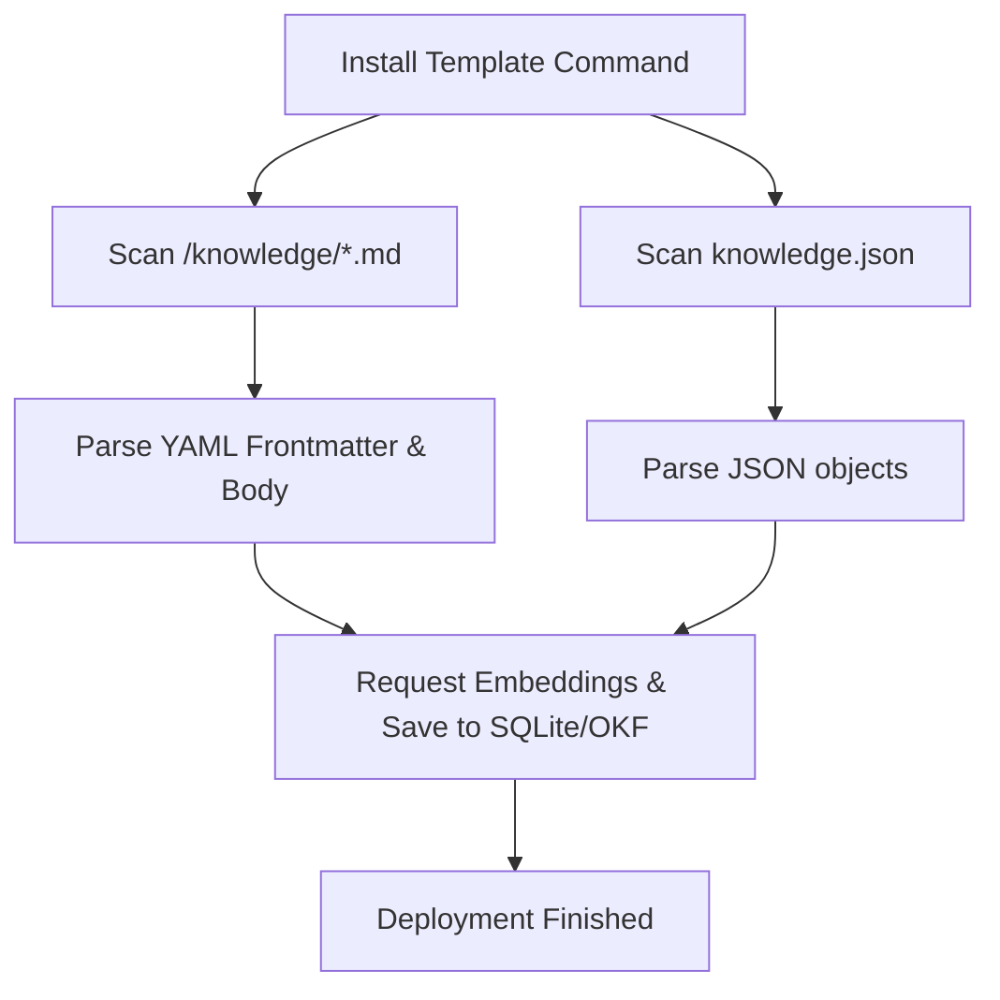

# Institutional Knowledge & Playbook Ingestion (OKF)

Tadpole OS swarms support seamless ingestion of corporate standard operating procedures (SOPs) and knowledge docs directly into the local **Open Knowledge Foundation (OKF)** vector database on installation. This ensures that new agents can instantly access compliance requirements, templates, and company policies.

---

## 📁 Playbook Formats

Swarm templates can bundle institutional knowledge in two distinct, concurrent formats:

### Format A: Markdown SOPs (Recommended)
Markdown files placed within a template's `/knowledge/` subdirectory are parsed and embedded. YAML frontmatter at the top of each markdown file is extracted to index metadata:

```markdown
---
title: "Factory ISO 9000 Receiving Procedure"
url: "https://wiki.internal.company.com/iso9000/receiving"
tags: "manufacturing, QA, receiving, ISO-9000"
description: "SOP for receiving incoming parts and verifying chemical batch sheets."
---
# Raw Materials Receiving SOP

1. Verify batch documentation matches container seal numbers.
2. Log container status in the shipping docket.
3. If container temperature is out of bounds, quarantine the batch.
```

The Tadpole OS server automatically extracts these parameters to index the document topic, URI, tags, and descriptive title during vector database storage.

### Format B: Structured JSON (`knowledge.json`)
For legacy systems, databases, or third-party catalog integration, you can provide a `knowledge.json` file in the template root directory containing an array of knowledge requests:

```json
[
  {
    "title": "Ad Spend Verification SOP",
    "description": "Validation checklist for marketing purchases.",
    "topic": "marketing",
    "concept_type": "playbook",
    "resource_uri": "https://wiki.internal.company.com/marketing/ad-spend",
    "tags": "marketing, advertising, compliance",
    "text": "Detailed standard operating procedure text goes here..."
  }
]
```

---

## ⚡ Ingestion Pipeline Mechanics

During template installation, the Tadpole OS backend runs the following ingestion workflow:



- **Resilient Degradation**: If vector memory or Ollama-based embedding generation is offline (e.g., due to low-power nodes or `PRIVACY_MODE=true` constraints), the engine logs a warning but proceeds with the installation of the swarm.
- **Deduplication**: Documents sharing the same `resource_uri` are checked for duplication. If the checksum or update timestamp has not changed, duplicate vector inserts are bypassed to prevent database bloat.
