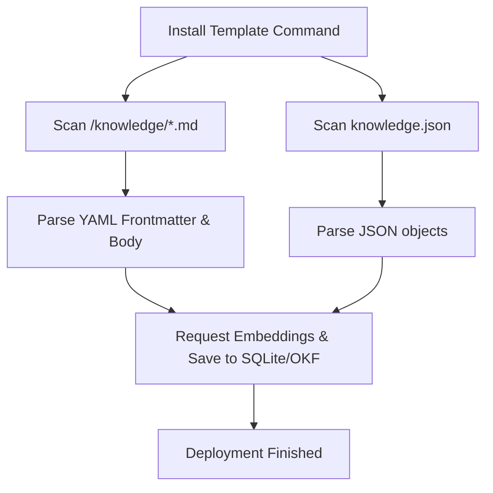

# Institutional Knowledge & Playbook Ingestion (OKF)

When vector memory and an embedding provider are available, Tadpole OS swarms can ingest corporate standard operating procedures (SOPs) and knowledge documents into the local **Open Knowledge Foundation (OKF)** store during installation.

---

## 📁 Playbook Formats

Swarm templates can bundle institutional knowledge in two distinct, concurrent formats:

### Format A: Markdown SOPs (Recommended)
Markdown files placed within a template's `/knowledge/` subdirectory are parsed and embedded. YAML frontmatter at the top of each markdown file is extracted to index metadata:

```markdown
---
title: "Factory ISO 9000 Receiving Procedure"
url: "https://wiki.internal.company.com/iso9000/receiving"
tags: "manufacturing, QA, receiving, ISO-9000"
description: "SOP for receiving incoming parts and verifying chemical batch sheets."
---
# Raw Materials Receiving SOP

1. Verify batch documentation matches container seal numbers.
2. Log container status in the shipping docket.
3. If container temperature is out of bounds, quarantine the batch.
```

The Tadpole OS server extracts supported frontmatter and ingests the Markdown body as the knowledge text. The body must contain the actual playbook; a reference such as `/workflows/example.md` is not resolved into that file's contents.

### Format B: Structured JSON (`knowledge.json`)
For legacy systems, databases, or third-party catalog integration, you can provide a `knowledge.json` file in the template root directory containing an array of knowledge requests:

```json
[
  {
    "title": "Ad Spend Verification SOP",
    "description": "Validation checklist for marketing purchases.",
    "topic": "marketing",
    "concept_type": "playbook",
    "resource_uri": "https://wiki.internal.company.com/marketing/ad-spend",
    "tags": "marketing, advertising, compliance",
    "text": "Detailed standard operating procedure text goes here..."
  }
]
```

Every entry must contain non-empty `text` and `topic` strings. Other metadata fields are optional at the pinned consumer revision.

---

## ⚡ Ingestion Pipeline Mechanics

During template installation, the Tadpole OS backend runs the following ingestion workflow:


```mermaid
graph TD
    Template[Install Template Command] --> DetectMD[Scan /knowledge/*.md]
    Template --> DetectJSON[Scan knowledge.json]
    DetectMD --> ParseFM[Parse YAML Frontmatter & Body]
    DetectJSON --> ParseEntries[Parse JSON objects]
    ParseFM --> Vectorize[Request Embeddings & Save to SQLite/OKF]
    ParseEntries --> Vectorize
    Vectorize --> Done[Deployment Finished]
```

- **Resilient Degradation**: If vector memory or embedding generation is unavailable, the engine can proceed with the rest of installation. Individual parsing or ingestion failures may not fail the overall install response, so successful installation alone is not proof that knowledge was indexed.
- **Deduplication**: Documents sharing the same `resource_uri` are checked for duplication. If the checksum or update timestamp has not changed, duplicate vector inserts are bypassed to prevent database bloat.

Swarm Architect now writes the full playbook text to both `knowledge.json` and `knowledge/*.md`, and prevents normalized knowledge filenames from colliding.
