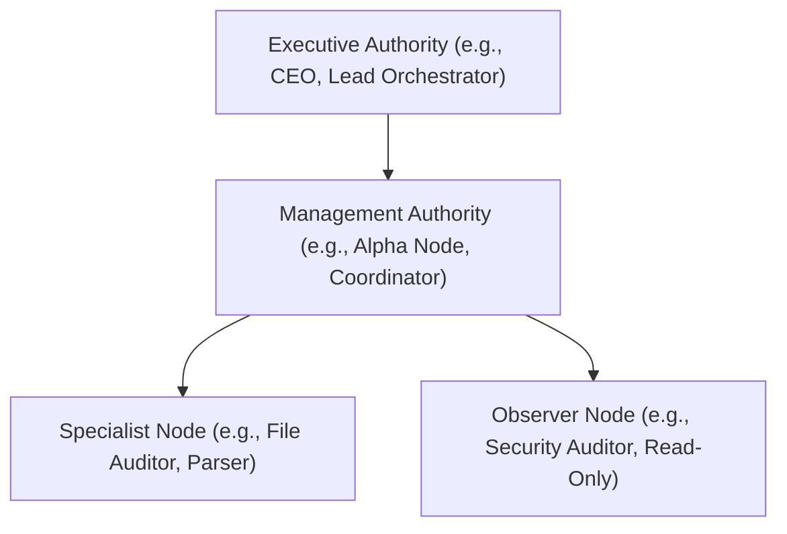

# Swarm Blueprints & Roster Hierarchies

Tadpole OS coordinates parallel multi-agent swarms using a structured organizational hierarchy. This page explains how rosters, authority levels, and industries are mapped within swarm blueprints.

---

## 📡 Agent Authority & Roster Levels

In any swarm blueprint (`swarm.json`), agents are assigned distinct roles and capabilities. The Tadpole OS runtime automatically maps these roles to the following authority framework:



1. **Executive**: Strategic planning, task delegation, and cross-swarm orchestration.
2. **Management**: Tactical division of objectives, monitoring of specialist progress, and consensus consolidation.
3. **Specialist**: Targeted task execution with scoped tool/skill access (e.g., executing scripts, editing documents, or indexing data).
4. **Observer**: Passive monitoring, compliance logs verification, and telemetry generation.

---

## 🏢 Roster Design: Knowledge Work vs. Edge Operations

For each of the 23 industries represented in the catalog, swarms are categorized into one of two archetypes:

### 1. Knowledge Work Swarms (Cognitive Layer)
- **Focus**: High-context information retrieval, document audits, policy synthesis, case law precedent research, and regulatory reporting.
- **Roster Characteristics**: Primarily high-context model allocations (e.g., `gemini-pro-latest`, `llama-3.3-70b-versatile`) equipped with read/write file access and specialized parsing/deduplication skills.
- **Example**: `legal-precedent-synthesis` or `financial-policy-synthesizer`.

### 2. Edge Operations Swarms (Transactional Layer)
- **Focus**: Supply chain tracking, inventory receiving audits, parts procurement QA, ISO 9000 compliance logs, and dock shipping coordination.
- **Roster Characteristics**: Highly-optimized, low-latency model allocations (e.g., `gemini-1.5-flash`, local `phi-3`) combined with automated verification scripts.
- **Example**: `manufacturing-iso9000-qa` or `ecommerce-dispatch-qa`.

---

## 📄 Swarm Configuration Schema (`swarm.json`)

Every template directory must host a `swarm.json` config. This file serves as the main blueprint parsed by the Tadpole OS installer. Here is the formal schema layout:

```json
{
  "$schema": "https://tadpoleos.dev/schemas/swarm-v1.json",
  "name": "Swarm Name",
  "version": "1.0.0",
  "author": "Author Name",
  "description": "Swarm description.",
  "industry": "Industry Category",
  "tags": ["tag1", "tag2"],
  "defaults": {
    "model": "llama-3.3-70b-versatile",
    "temperature": 0.4
  },
  "roster": [
    {
      "id": "coordinator_agent_id",
      "path": "agents/coordinator_agent_id.json",
      "supervisor": null,
      "priority": "critical"
    },
    {
      "id": "specialist_agent_id",
      "path": "agents/specialist_agent_id.json",
      "supervisor": "coordinator_agent_id",
      "priority": "normal"
    }
  ],
  "required_mcps": "mcps.json",
  "global_workflows": ["workflows/step_by_step_sop.md"]
}
```
