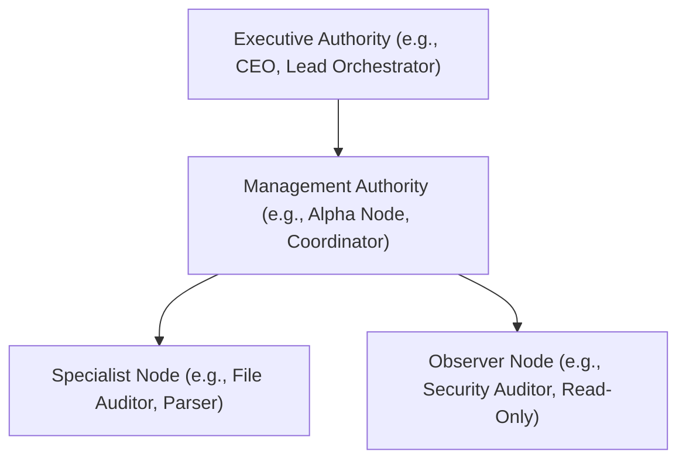

# Swarm Blueprints & Roster Hierarchies

Tadpole OS coordinates parallel multi-agent swarms using a structured organizational hierarchy. This page explains how rosters, authority levels, and industries are mapped within swarm blueprints.

---

## 📡 Agent Authority & Roster Levels

In any swarm blueprint (`swarm.json`), agents are assigned distinct roles and capabilities. The Tadpole OS runtime automatically maps these roles to the following authority framework:


```mermaid
graph TD
    Executive["Executive Authority (e.g., CEO, Lead Orchestrator)"] --> Management["Management Authority (e.g., Alpha Node, Coordinator)"]
    Management --> Specialist["Specialist Node (e.g., File Auditor, Parser)"]
    Management --> Observer["Observer Node (e.g., Security Auditor, Read-Only)"]
```

1. **Executive**: Strategic planning, task delegation, and cross-swarm orchestration.
2. **Management**: Tactical division of objectives, monitoring of specialist progress, and consensus consolidation.
3. **Specialist**: Targeted task execution with scoped tool/skill access (e.g., executing scripts, editing documents, or indexing data).
4. **Observer**: Passive monitoring, compliance logs verification, and telemetry generation.

---

## 🏢 Roster Design: Knowledge Work vs. Edge Operations

Across the 25 industries represented in the catalog, swarms use one of two core archetypes. Field Services and Wholesale & Distribution also include compact three-agent starter teams for businesses with up to 25 seats:

### 1. Knowledge Work Swarms (Cognitive Layer)
- **Focus**: High-context information retrieval, document audits, policy synthesis, case law precedent research, and regulatory reporting.
- **Roster Characteristics**: Primarily high-context model allocations (e.g., `gemini-pro-latest`, `llama-3.3-70b-versatile`) equipped with read/write file access and specialized parsing/deduplication skills.
- **Example**: `legal-precedent-synthesis` or `financial-policy-synthesizer`.

### 2. Edge Operations Swarms (Transactional Layer)
- **Focus**: Supply chain tracking, inventory receiving audits, parts procurement QA, ISO 9000 compliance logs, and dock shipping coordination.
- **Roster Characteristics**: Highly-optimized, low-latency model allocations (e.g., `gemini-1.5-flash`, local `phi-3`) combined with automated verification scripts.
- **Example**: `manufacturing-iso9000-qa` or `ecommerce-dispatch-qa`.

### Small-Business Operations Starters (25 Seats or Fewer)

- **Field Services**: Dispatch coordination, estimate and work-order preparation, customer follow-up, and daily exception review for home services, repair, and maintenance businesses.
- **Wholesale & Distribution**: B2B quote preparation, account operations, inventory replenishment planning, and order-fulfillment exception handling.
- **Human control**: All six agents can prepare operational drafts, but every file-writing capability is marked for oversight. People retain approval of schedules, quotes, pricing, purchase orders, inventory release, shipments, and outbound customer messages.

---

## 📄 Swarm Configuration Schema (`swarm.json`)

Every template directory must host a `swarm.json` config. It is the registry's portable blueprint and round-trip metadata format. At the currently pinned consumer revision, the installer copies this file but does not deserialize its roster, defaults, workflows, or MCP references; operational installation comes from scanning the template directories and root `mcps.json` directly.

```json
{
  "$schema": "https://tadpoleos.dev/schemas/swarm-v1.json",
  "name": "Swarm Name",
  "version": "1.0.0",
  "author": "Author Name",
  "description": "Swarm description.",
  "industry": "Industry Category",
  "tags": ["tag1", "tag2"],
  "defaults": {
    "model": "llama-3.3-70b-versatile",
    "temperature": 0.4
  },
  "roster": [
    {
      "id": "coordinator_agent_id",
      "path": "agents/coordinator_agent_id.json",
      "supervisor": null,
      "priority": "critical"
    },
    {
      "id": "specialist_agent_id",
      "path": "agents/specialist_agent_id.json",
      "supervisor": "coordinator_agent_id",
      "priority": "normal"
    }
  ],
  "required_mcps": "mcps.json",
  "global_workflows": ["workflows/step_by_step_sop.md"]
}
```

---

## 🧠 Capability-Based Agent Profiles & Workflows

With the transition to the native Tadpole OS capability-based architecture:
* **Decoupled Instructions**: The agents' monolithic prompts have been separated into a slim personality definition (under `agents/*.json`) and a structured markdown SOP playbook (under `workflows/*.md`).
* **Required Runtime Identity**: Every profile supplies non-empty `id`, `name`, `role`, `department`, `description`, and `status` values. Registry agents begin with the upstream-native `status: "idle"`.
* **Explicit Model Configuration**: `model_config` contains `provider`, `model_id`, and a system prompt of at most 800 characters. An explicit provider prevents unknown model strings from falling back to the wrong provider.
* **Workflow Execution Headings**: The pinned parser treats any `##` or `###` heading as a step boundary. The registry recommends `## Step N: Name` for clarity and portability.
* **Explicit Capability Intent**: Profiles include `skills`, `workflows`, `mcp_tools`, and `requires_oversight`. Use native `write_file`; shell agents require `execute_shell` plus `shell` and oversight. These declarations do not replace the runtime ACL.

Example agent profile:

```json
{
  "id": "specialized-legal-review",
  "name": "Legal Review Specialist",
  "role": "Contract Reviewer",
  "department": "Legal Operations",
  "description": "Performs evidence-based first-pass contract review.",
  "status": "idle",
  "model_config": {
    "provider": "google",
    "model_id": "gemini-pro-latest",
    "system_prompt": "Review contracts carefully and follow the associated workflow SOP."
  },
  "skills": ["read_file"],
  "workflows": ["legal_review"],
  "mcp_tools": [],
  "requires_oversight": false
}
```

The current installer scans every `agents/*.json` file, not only those named in the manifest roster. Keep the directory free of drafts or invalid profiles.

---

## 🛠️ Swarm Architect Setup Experiences

The visual Swarm Architect builder provides two tailored workflows that share an underlying configuration state and validation pipeline:

### 1. Guided Setup (Business Owners & Operators)
Designed for rapid blueprinting without technical jargon:
- **Step 1 (Business Brief)**: Company name, size, industry, and multi-goal selection (e.g., scheduling, quoting, customer follow-up, inventory management).
- **Step 2 (Team Recommendations)**: Round-robin goal distribution generates a tailored specialist team with explicit operational boundaries (*What it reads, What it prepares, What requires human approval*), scaled to organization size.
- **Step 3 (Connections & Governance)**: Plain-language connector cards and read-only explanations of how Tadpole OS enforces human-in-the-loop oversight at runtime.
- **Step 4 (Review & Export)**: Live validation metrics and one-click consumer-compatible `.zip` archive download.

### 2. Advanced Setup (Developers & Administrators)
Full technical control across 5 granular steps:
- **Identity**: Industry taxonomy, custom industry codes, and mission definition.
- **Roster**: Granular agent prompt editing with live character count (&le; 800 chars), provider inference, and exact capability assignments.
- **Playbooks**: Structured step builders and raw Markdown SOP editors with syntax validation.
- **Connectors**: MCP server definitions, argument arrays, and environment variable requirements.
- **Forge**: Comprehensive live validation diagnostics and export packaging.

### 3. Draft Persistence & Secret Privacy
- The web builder automatically persists work-in-progress blueprints in browser `localStorage` under `tadpole_builder_draft_v1`.
- **Privacy Guarantee**: Blueprint drafts store structural configurations, prompts, and playbooks. Connector credential fields and sensitive secrets are never stored.
